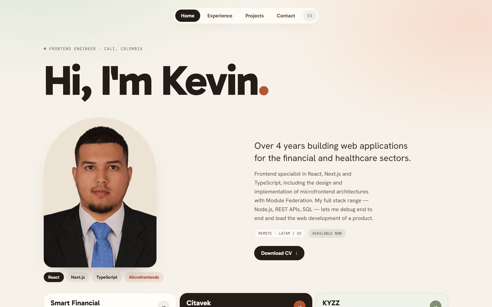
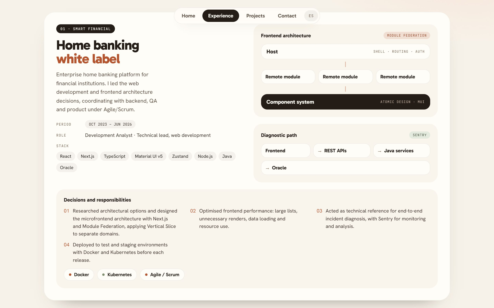
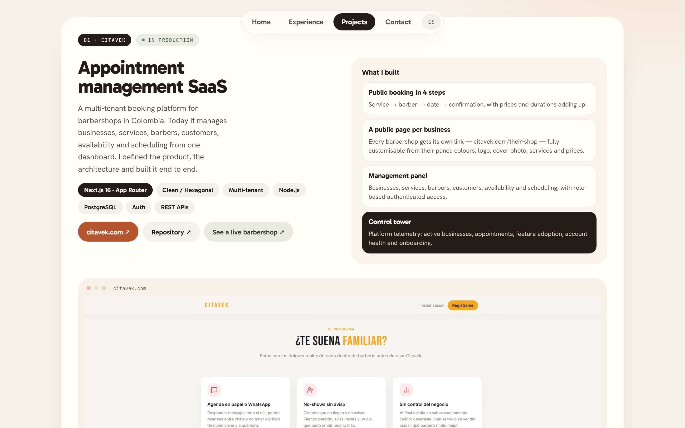
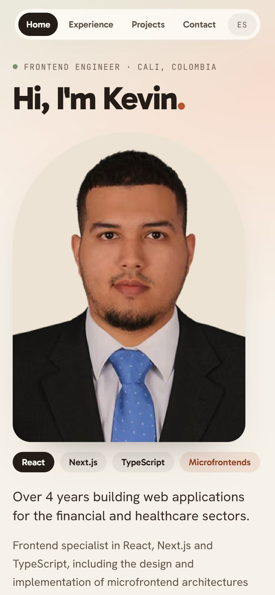

# Kevin Rodríguez — Portfolio

Personal portfolio of **Kevin Rodríguez**, Frontend Engineer (React · Next.js · TypeScript · Microfrontends) based in Cali, Colombia.
Bilingual (Spanish / English), statically generated and built to be read by recruiters and reviewed by engineers.

**Live:** [kevin-portafolio-seven.vercel.app](https://kevin-portafolio-seven.vercel.app/es) · [English](https://kevin-portafolio-seven.vercel.app/en) · CV: [ES](https://kevin-portafolio-seven.vercel.app/cv/kevin-rodriguez-cv-es.pdf) / [EN](https://kevin-portafolio-seven.vercel.app/cv/kevin-rodriguez-cv-en.pdf)



<table>
  <tr>
    <td></td>
    <td></td>
    <td width="22%"></td>
  </tr>
</table>

## Highlights

- **Server-first.** Every page is a React Server Component. Only three components run on the client, each with a concrete reason documented at the top of the file: the navigation state, the scroll reveal and the portrait tilt.
- **Fully static.** Eight routes (`/es`, `/en` × Home, Experience, Projects, Contact) are prerendered with `generateStaticParams`; unknown paths get a real 404.
- **Design system as code.** The visual design was made in Claude Design and translated 1:1 into Tailwind CSS v4 tokens — colour, type scale, radii, shadows and fluid spacing — instead of copying generated markup.
- **Typed content.** Copy lives in typed Spanish and English dictionaries; `satisfies SiteContent` makes the compiler reject a missing translation.
- **Accessible by default.** One `h1` per page, skip link, visible focus, AA contrast, hover-only content reachable by keyboard and touch, and `prefers-reduced-motion` respected. axe reports no violations on any page.
- **SEO complete.** Per-page metadata, `hreflang` alternates, canonical URLs, sitemap, robots, JSON-LD `Person` and Open Graph images generated per language.

## Lighthouse

Measured on production with Lighthouse 12, mobile emulation, September 2026.

| Page | Performance | Accessibility | Best practices | SEO | LCP | CLS |
| --- | :-: | :-: | :-: | :-: | :-: | :-: |
| Home | 96 | 100 | 100 | 100 | 2.3 s | 0 |
| Experience | 96 | 100 | 100 | 100 | 2.3 s | 0 |
| Projects | 95 | 100 | 100 | 100 | 2.5 s | 0 |
| Contact | 98 | 100 | 100 | 100 | 2.2 s | 0 |

## Tech stack

| Area | Choice |
| --- | --- |
| Framework | Next.js 16 (App Router, Turbopack) · React 19 |
| Language | TypeScript (`strict`, `noUncheckedIndexedAccess`) |
| Styling | Tailwind CSS v4 (CSS-first `@theme` tokens) |
| Fonts | `next/font` — Gabarito, Hanken Grotesk, JetBrains Mono |
| Images | `next/image` with static imports (AVIF/WebP, intrinsic sizes, no layout shift) |
| Quality | ESLint (`eslint-config-next`), `tsc --noEmit` |

No UI library, no state manager, no class-name helpers: the project only depends on Next.js, React and Tailwind.

## Architecture

```text
src/
├── app/                 # Routes only: /[lang] root layout, pages, metadata files, 404
├── components/
│   ├── ui/              # Typed primitives: Chip, Tag, PillLink, Panel, DiagramNode, DetailBlock…
│   ├── layout/          # Site header and navigation, page intro, next-step link
│   └── motion/          # Reveal marker + the two motion client components
├── features/            # Page sections grouped by domain: home, experience, projects, contact
├── data/content/        # es.ts / en.ts dictionaries + shared facts (links, images)
├── lib/                 # i18n helpers, SEO metadata builder, fonts, small utilities
├── styles/globals.css   # Design tokens and the few custom utilities
├── types/content.ts     # Content model shared by both languages
└── assets/              # Screenshots, portrait and OG-image fonts (OFL)
```

- **Routing and i18n.** `app/[lang]` is the root layout; `/` redirects to `/es`. Both languages share the same slugs and the language switch keeps the current page. `next/root-params` gives server components the locale without prop drilling.
- **Composition over configuration.** Components expose small, typed variant maps (discriminated unions) rather than free-form class names. A primitive is promoted from `features/` to `components/` only when a second feature needs it.
- **Responsive without breakpoints.** Layouts use intrinsic `auto-fit` grids and fluid `clamp()` sizes, so each section reflows where its own content needs it.

## Getting started

```bash
npm install
npm run dev        # http://localhost:3000 → redirects to /es
npm run typecheck  # route types + tsc
npm run lint
npm run build      # static production build
```

Set `NEXT_PUBLIC_SITE_URL` to the production domain so canonical URLs, the sitemap and Open Graph images use it (on Vercel the project's production URL is used automatically).

## Editing content

- **Texts:** `src/data/content/es.ts` and `en.ts`. TypeScript flags any field missing in either language.
- **Images:** add them to `src/assets/` and reference them from `src/data/content/shared.ts`.
- **CV:** the downloadable PDFs in `public/cv/` are printed from `docs/cv/cv-es.html` and `cv-en.html`. Open the HTML in a browser and use *Print → Save as PDF* (Letter, default margins).

## Credits

Visual design created with Claude Design and implemented by hand in this repository.
Fonts: Gabarito, Hanken Grotesk and JetBrains Mono, under the SIL Open Font License (see `src/assets/fonts`).
Content and product screenshots © Kevin Rodríguez. Customer data in the KYZZ captures is blurred.
